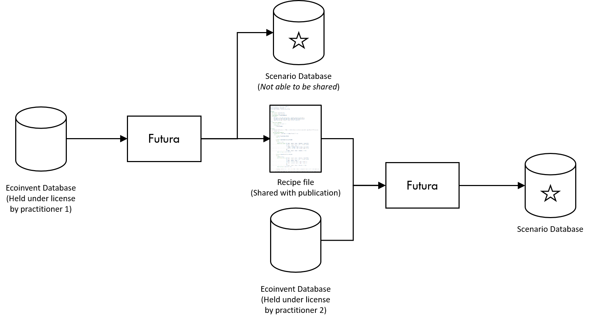

# Futura

Futura is a software interface to generate arbitrary future background databases for LCA sensitivity analyses.

## Introduction

The world of 2050 will be very different to the world of 2019.

For emerging technologies and long-lived products, decisions made today will have a direct effect on the environmental
impact which occurs in the future. While it is impossible to accurately predict what the world will look like in the
future, it is possible come up with sensible assumptions representing a range of possible future scenarios.

In order for the future impact of products to be estimated in a consistent and meaningful manner in LCA, the background
system - most commonly the ecoinvent database - needs to be projected into the future alongside the foreground system
modelled in a given study. This is not a trivial task. The latest version of the ecoinvent database contains over 18,000
interlinked processes. External factors, such as technology availability and electricity grid mixes, determined by
future scenarios have the potential to affect every single one of these processes.

Recent developments in advanced open-source LCA software have opened up the opportunity to apply database wide changes
to modelling assumptions. This technique can be extended to alter the entire database to reflect future scenarios in a
systematic way.

Futura is a new piece of open-source software which allows LCA practitioners to create and, importantly,
**share** novel background databases representing arbitrary scenarios.

It allows users to import a base database and then start making targeted changes. These changes take three main forms:

- adding new technologies
- regionalising new or existing technologies, and
- altering market compositions.

These actions allow the creation of scenarios ranging from the simple, such as altered electricity grid mixes, to the
complex, where technologies such as carbon capture and storage or electrified transportation have become commonplace.

All changes made are automatically added to a *recipe* which can be exported as a human readable file (written in yaml).
This recipe file contains no proprietary or licensed data and can be shared publicly, for example as supplementary 
material to a publication. This recipe can be imported by other users, and combined with their own version of the base 
database to exactly recreate the modified database that was originally created. 

The additive and transparent nature of this system means that initially simple scenarios can be built upon by other 
practitioners to progress towards more comprehensive scenarios in a stepwise manner.

Futura includes a scripting interface, in order to integrate with existing scripting based softwares, but also includes 
a graphical user interface, allowing users to carry out all of the tasks required to create and share modified 
background databases without writing a single line of code.

