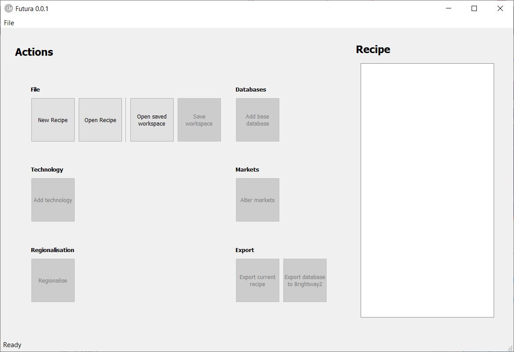

# Futura


[](https://travis-ci.com/pjamesjoyce/futura)

[](https://coveralls.io/github/pjamesjoyce/futura?branch=master)


Futura is a software interface to generate arbitrary future background databases for LCA sensitivity analyses.

Online documentation, including full installation instructions, is available [here](http://futura.readthedocs.io)


## Installation

### Basic Installation

The easiest way to install Futura is via conda. This ensures the version of Python (3.6+) is correct,
all of the dependencies are correct and there are no conflicts.

You can also do it in only 3 commands.

If you don't have conda installed yet, first install Miniconda (available [here](https://conda.io/miniconda.html))

1) On the command line/console, create a new environment called futura:
    ```
    conda create -n futura python=3
    ```

2) Activate the futura environment using one of these:
    ```
    # Mac/Linux
    source activate futura
    # Windows
    activate futura
    ```

3) Install futura:
    ```
    conda install -y -q -c conda-forge -c cmutel -c haasad -c konstantinstadler -c pjamesjoyce futura
    ```
    
## Using Futura

The easiest way to use Futura is via its user interface. Once you have installed futura you can launch the user
interface by activating your futura environment and typing `futura_ui` like this:

```bash
$ activate futura
(futura) $ futura_ui
```

This will launch the user interface (written with Pyside2) which looks a bit like this:

